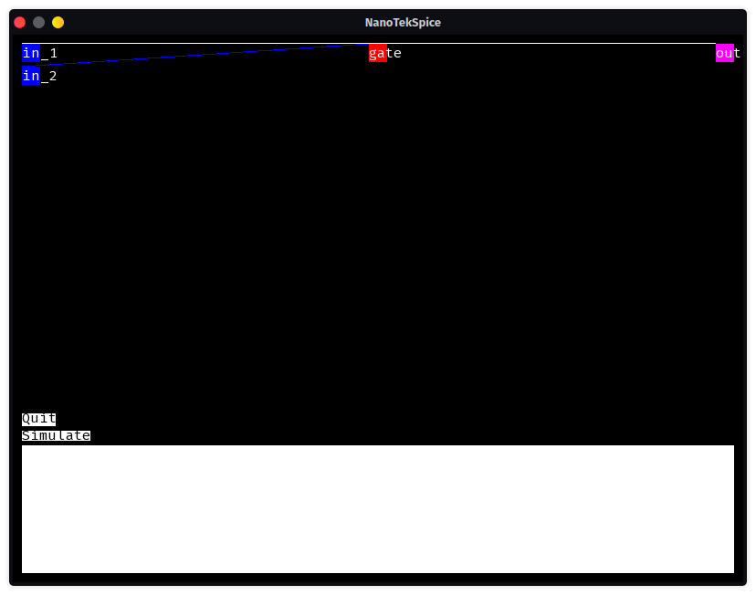

# NanoTekSpice

## Installation

```bash
git clone https://github.com/Saverio976/NanoTekSpice2023.git
cd NanoTekSpice2023
make
```

## Usage

`./nanotekspice --help`
```txt
Usage: ./nanotekspice [circuit_file.nts]

Simulates electronics components
Circuit file contains info on both what chipset are used and how they are linked
You can find example files in tests/nts_files
Here is a list of components (you can read more on how they work in the documentation folder):

        Special components:
                input: a component with a single pin directly linked to the command line. Its value is initialized to undefined.
                clock: a component that works like an input, except its value is inverted after each simulation.
                true: a component with a single pin that is always true.
                false: a component with a single pin that is always false.
                output: a component with a single pin used as the output of a circuit.
        Elementary components:
                and: single AND gate.
                or: single OR gate.
                xor: single XOR gate.
                not: single INVERTER gate.
        Gates components:
                4001: Four NOR gates.
                4011: Four NAND gates.
                4030: Four XOR gates.
                4069: Six INVERTER gates.
                4071: Four OR gates.
                4081: Four AND gates.
        Advanced components:
                4008: 4 bits adder.
                4013: Dual Flip Flop.
                4017: 10 bits Johnson decade.
                4040: 12 bits counter.
                4094: 8 bits shift register.
                4512: 8 channel data selector.
                4514: 4 bits decoder.
                4801: Random access memory.
                2716: Read only memory (memory initialized from ./rom.bin)

And here's the truth table:
        | A | B |AND|OR |XOR|
        | 0 | 0 | 0 | 0 | 0 |
        | 0 | 1 | 0 | 1 | 1 |
        | 0 | U | 0 | U | U |
        | 1 | 0 | 0 | 1 | 1 |
        | 1 | 1 | 1 | 1 | 0 |
        | 1 | U | U | 1 | U |
        | U | 0 | 0 | U | U |
        | U | 1 | U | 1 | U |
        | U | U | U | U | U |
```

## Examples

### And Gate

```bash
# ./nanotekspice tests/nts_files/single/and.nts
> display
tick: 0
input(s):
  in_1: U
  in_2: U
output(s):
  out: U
> in_1 = 1
> help  
List of commands:
        help:           Displays commands and what they do.

        display:        Displays the current tick, input(s) value(s) and output(s) value(s).

        simulate:       Updates the circuit and advances the ticks

        loop:           Continuously calls simulate and display until (CTRL+C) is pressed.

        exit:           Exits the program, same as (CTRL+D).

        [in]=[0|1|U]:   Changes the value of the input component named in to false, true or undefined respectively.
                        Note that to update the changes, you need to call simulate.
                        Only works in input and clock components, throws an error if used on anything else
> simulate
> display
tick: 1
input(s):
  in_1: 1
  in_2: U
output(s):
  out: U
> in_2 = 0
> simulate
> display
tick: 2
input(s):
  in_1: 1
  in_2: 0
output(s):
  out: 0
> in_2 = 1
> simulate
> display
tick: 3
input(s):
  in_1: 1
  in_2: 1
output(s):
  out: 1
> 
```

### GUI Mode

```bash
cd bonus/graphic
make
# ./nanotekspice ../../tests/nts_files/single/and.nts
```


